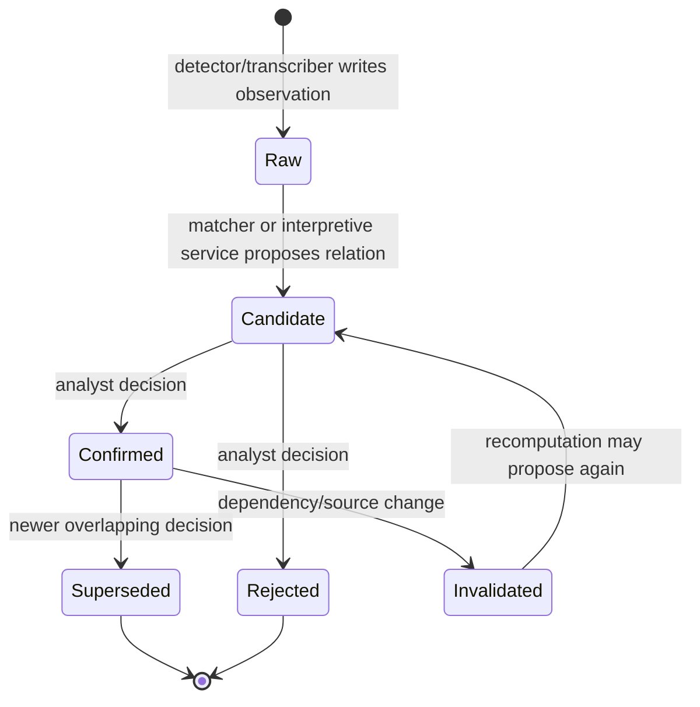

# Datascene architecture and epistemic data flow

## Logical architecture

```mermaid
flowchart LR
  M[Source media] --> I[FFmpeg probe and ingestion]
  I --> A[Audio / Whisper]
  I --> V[Frames / YOLO / OCR / DeepFace]
  A --> C[Source-clock authority]
  V --> C
  C --> R[(Raw analysis artifacts)]
  R --> UI[Video and leaf panels]
  UI --> D[Analyst correction command]
  D --> L[(Append-only decision ledger)]
  L --> P[Projected state: decision > manual > raw]
  R --> P
  P --> B[Dependency invalidation and live bus]
  B --> SC[Scene cards / meaning / Narrative Agents]
  B --> ST[StatsKit and native statistics]
  SC --> G[Governed claims]
  ST --> G
  G --> DB[Checksummed data-book / corpus publication]
  DB --> T[Traceback to source, time, ROI and decision]
```

FastAPI initialization, storage roots and in-memory job status are defined in `api_server.py`, lines 241–286. Atomic analysis records and lightweight catalogue ownership are persisted at lines 428–484. The frontend’s persistent workbench arrangement is registered in `src/frontend/components/LayoutHost.tsx`, lines 189–287 and 576–879.

## Data lifecycle and authority

The ledger rejects non-analyst canonical writes and appends immutable, idempotent events (`src/backend/analysis/decision_ledger.py`, lines 89–251). Current state is a projection with decision > manual > raw precedence (`src/backend/analysis/projected_state.py`, lines 140–230). Correction acknowledgement occurs after durable write; consumer projection may then proceed in background (`api_server.py`, lines 13883–13932). Thus “saved” means the authority event is durable, not necessarily that every derived panel has already refreshed.

## Temporal and spatial synchronization

The modern clock representation is source-relative seconds with explicit authority and precision. The authority rank, normalization and 30 ms overlap tolerance are implemented in `src/backend/analysis/source_clock_authority.py`, lines 8–99. A correction can enumerate dependent decisions affected by a clock change, lines 102–142. Transcript relinking rebuilds transcript, prosody, audio events, diarization, time-bank and linguistic/statistical consumers (`api_server.py`, lines 7628–7707).

Spatial synchronization is a time-scoped ROI/bbox attached to a media locator. Visual sampling emits timestamp, class, confidence and bbox (`src/backend/analysis/pipeline_video_frames.py`, lines 390–453). The older envelope schema expresses locators and anchors in milliseconds (`src/backend/analysis/timestamp_schema.py`, lines 18–150), while the newer authority uses seconds. That duality is a compatibility layer and a reproducibility hazard, not two equally valid clocks.

## Epistemic transformation

| Layer | Permitted assertion | Typical producer | Authority rule |
|---|---|---|---|
| Raw observation | “Detector/transcriber emitted X at time t” | Whisper, YOLO, OCR, DeepFace | Never equivalent to analyst truth |
| Derived measurement | “Computed value f(X) under parameters p” | timing, descriptive statistics, scene aggregation | Must retain inputs/parameters |
| Candidate interpretation | “Evidence supports possible relation Y” | matcher, Narrative Agent scoring, meaning modules | Candidate-only writer |
| Confirmed interpretation | “Analyst accepted/rejected Y” | decision ledger | Analyst authority only |
| Governed claim | “Eligible confirmed/qualified result with citations” | reporting service | Evidence and traceback mandatory |
| Publication | “Frozen export of eligible records” | data-book service | checksums and source references |

These transitions are implemented by ledger authority checks (`decision_ledger.py`, lines 89–100), projection precedence (`projected_state.py`, lines 140–230), and reporting eligibility (`governed_reporting.py`, lines 78–155).

## Execution environment

The documented Mac path uses separate `vaa1_core` and `vaa1_face` Conda environments (`README.md`, lines 22–54; `environment-MacOS-core.yml`; `environment-MacOS-face.yml`, lines 17–38). This separation limits TensorFlow/DeepFace conflicts. It also creates an orchestration dependency: successful core analysis does not prove that face analysis ran. The backend serializes heavyweight analysis with one lock and checks memory headroom (`api_server.py`, lines 93–121). Recovery uses atomic fsync-and-replace writes and resumable checkpoints (`src/backend/analysis/analysis_recovery.py`, lines 15–113).

## Deployment boundary

The audited architecture is best described as a local research instrument. CORS-enabled FastAPI and a browser workbench are operational (`api_server.py`, lines 241–259), but authentication, multi-user isolation, database transactions, distributed queues and production observability were not established by this audit. The file-backed catalogue and in-memory job status should not be described as a production multi-tenant platform.
