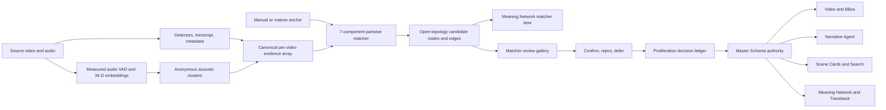
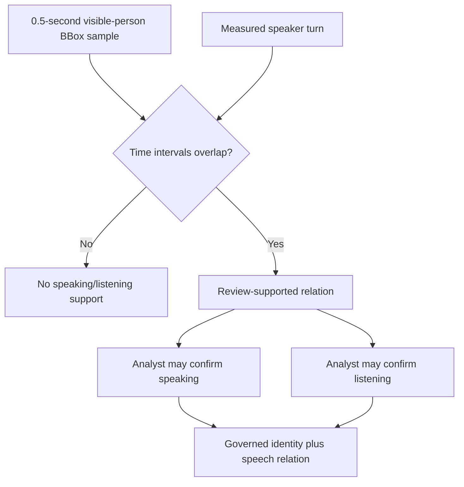
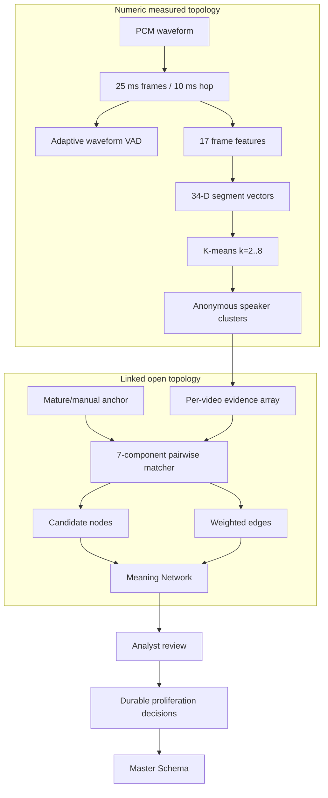
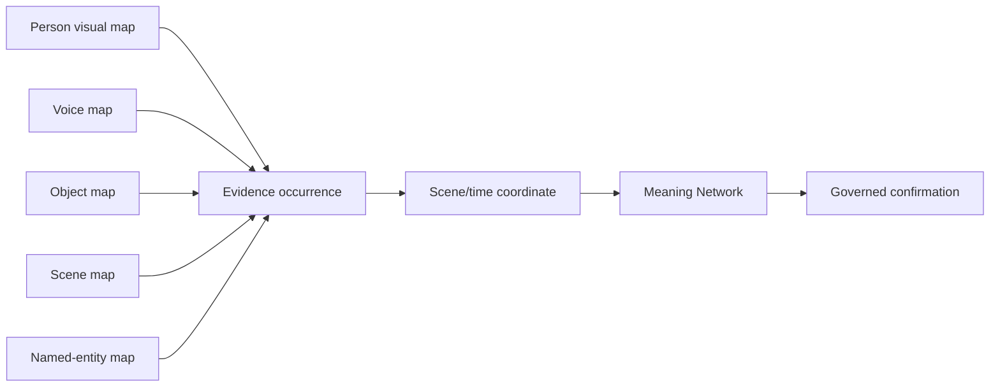

# VAA1 Open-Topology SOM Scanner / Matcher Handout

Date: 2026-06-22

Operational update: 2026-06-25

Purpose: explain the current scanner/matcher layer for Datascene/VAA1 Mature Data Proliferation: what it is for, what it is made of, how it works in practice, and how it should be developed next.

## Exact Technical Status

The word `SOM` is currently used for two related but technically different
mechanisms. This distinction is important.

1. **Measured audio topology is numeric clustering.**
   - The audio analysis calculates a 34-dimensional acoustic vector for every
     timed transcript segment.
   - The vectors are standardized and clustered with K-means.
   - The number of clusters is selected by silhouette score.
   - This is real measured computation over the source waveform.

2. **The open-topology proliferation SOM is currently a governed similarity
   graph, not a trained Kohonen Self-Organizing Map.**
   - Each candidate receives a seven-component similarity profile.
   - The components are combined into a normalized match probability.
   - Candidate neighborhoods are represented as source-linked nodes, edges,
     and clusters.
   - There is no fixed two-dimensional neuron grid, neighborhood radius,
     learning rate, epoch count, or Kohonen weight update in the current
     implementation.

Therefore:

```text
audio clustering = actual numeric feature vectors + learned cluster assignment
open-topology SOM = traceable multimodal similarity graph + governed review
```

Calling the second mechanism an open-topology SOM describes its product
purpose and graph topology. It must not be mistaken for a currently trained
Kohonen map.

## Current Operational Feature Inventory

The following behavior is operational as of 2026-06-25.

### Matcher launch and review

- Matcher launch from a Meaning Network node or edge.
- Matcher launch from the BBox/ROI evidence workflow.
- Analysis-wide scanner refresh through
  `POST /api/analysis/{analysis_id}/proliferation/refresh`.
- One-anchor matching through
  `POST /api/analysis/{analysis_id}/proliferation/match`.
- Meaning Network `Matcher / SOM candidates` lane.
- Source-linked candidate nodes and weighted similarity edges.
- Visual matcher gallery with BBox/ROI overlay.
- Separate gallery sections for known samples, identity candidates, and
  contextual support.
- Multi-candidate checking followed by one saved review round.
- Confirm, reject, defer, and clear controls.
- Durable decisions in
  `annotation_corrections.proliferation_decisions`.
- Confirmed matches become user-confirmed truths routed to Master Schema,
  Meaning Network, Narrative Agent, Video/BBox, Scene Cards, Search, and
  Traceback.

### Full-timeline candidate behavior

- Raw detector tracks are neutral detector substrate, not predeclared
  Narrative Agents.
- Character candidate selection samples the whole video timeline instead of
  filling the queue only from the beginning of the video.
- Candidate review quality uses detector confidence, occurrence count, and
  BBox area.
- Same-time/same-space duplicate person detections are merged before review.
- The default character queue reserves capacity for known anchors, unknown
  identity candidates, and contextual evidence.
- A visual identity review uses a 0.5-second representative sample.
- The longer detector-track interval is retained as provenance and scene
  support, not treated as a continuous identity proof.

### Narrative Agent presence claims

One confirmation no longer silently means four different things. The matcher
keeps separate claims for:

- `visual_presence`: the person is visibly on screen in the short BBox sample;
- `scene_presence`: the person participates in the broader scene/track context;
- `speaking`: measured speech overlaps the visible sample and the analyst
  assigns that speech to the identity;
- `listening`: the identity is visible while measured speech occurs and the
  analyst confirms a listening relation.

`On screen` is the default visual identity confirmation. Speaking and
listening remain separate review claims because temporal overlap alone cannot
identify the voice owner.

### Actual measured audio

The former audio scaffold path has been replaced by source-waveform
measurement:

- PCM audio is read and converted to mono.
- Audio is resampled to 16 kHz where necessary.
- Waveform voice activity is measured.
- Timed transcript segments receive acoustic feature vectors.
- Speaker-like acoustic clusters are computed.
- Measured speaker turns and embeddings are persisted.
- Audio sample clouds are rebuilt when measured diarization replaces an older
  artifact.
- Failed or invalid audio produces `measurement_failed` and zero audio
  evidence. It does not manufacture speaker turns.

The acoustic clusters are anonymous `SPEAKER_nn` groups. They are not named
identities until a verified voice sample or analyst decision supplies that
authority.

## Which Detections Currently Have SOM or Matcher Support

| Detection / feature family | Operational mechanism | Numeric vector today | Current authority |
|---|---|---:|---|
| Measured speech turns | Acoustic clustering | 34 dimensions | Anonymous speaker cluster, not identity |
| Narrative Agent / person continuity | Seven-component closest-match graph | 7 components | Candidate until analyst confirmation |
| Objects and props | Shared closest-match graph | 7 components | Candidate; no object embedding yet |
| Named entities | Token/context closest-match graph | 7 components | Candidate; OCR/transcript/metadata anchored |
| Scene settings | Setting-token and visual/cinematic context matcher | 7 components | Candidate; no scene embedding yet |
| Speaker/voice continuity | Shared matcher over measured audio turns/clouds | 7 match components; 34-D audio vectors stored | Candidate; raw vector distance is not yet used by matcher |
| Sound events / ambient sound / music motifs | Shared audio-context matcher | 7 components | Candidate; no specialist motif embedding yet |
| Prosody delivery patterns | Shared audio/prosody matcher | 7 components | Candidate |
| Visual patterns | Shared visual/context matcher | 7 components | Candidate; no CLIP/re-identification embedding yet |
| Actions and interactions | Shared label, time, track, and context matcher | 7 components | Candidate |
| Scene/episode patterns | Shared scene/context matcher | 7 components | Candidate |
| OCR phrases | Token/time/context matcher | 7 components | Candidate |

These are not thirteen independently trained SOMs. They are target-specific
matching regimes over one shared evidence collector and governance shell. The
audio acoustic clusterer is currently the only separately fitted numeric
cluster model.

## Input Vectors and Dimensions

### A. Open-topology matcher profile: 7 components

For each seed-candidate pair, the matcher calculates:

| Index | Component | Range | Meaning |
|---:|---|---:|---|
| 1 | `text_semantic` | 0-1 | Jaccard overlap of normalized seed and candidate tokens |
| 2 | `time_proximity` | 0-1 | Distance between seed and candidate interval centers |
| 3 | `spatial_consistency` | 0-1 or absent | BBox IoU and center-distance compatibility |
| 4 | `track_continuity` | 0 or 1 | Same source track id |
| 5 | `contextual_modality` | 0-1 | Target-specific compatibility of source modality/category |
| 6 | `sample_cloud_support` | 0-1 | Sample-cloud confidence or semantic overlap |
| 7 | `cross_scene_continuity` | 0-1 | Mature/manual/sample/track/spatial continuity support |

The current base weights are:

```text
text_semantic          0.16
time_proximity         0.12
spatial_consistency    0.22
track_continuity       0.18
contextual_modality    0.12
sample_cloud_support   0.10
cross_scene_continuity 0.22
```

Only positive, available components participate. Their active weights are
renormalized for each candidate:

```text
P(match) = sum(component_i * weight_i) / sum(active_weight_i)
```

This is a seven-dimensional pairwise comparison profile, not a persistent
seven-dimensional neuron map.

Character-specific probability caps:

- unknown person or known identity option: maximum `0.62`;
- contextual support: maximum `0.44`;
- incompatible named identity: `0.0`.

### B. Measured audio vector: 34 dimensions

Every timed transcript segment receives a frame-derived acoustic embedding.

Per audio frame, 17 features are calculated:

```text
1  RMS energy in dB
1  zero-crossing rate
1  normalized spectral centroid
1  spectral flatness
1  normalized spectral rolloff
12 cepstral coefficients from 20 logarithmic frequency bands
--
17 frame features
```

The segment embedding concatenates the mean and standard deviation of all 17
features:

```text
17 means + 17 standard deviations = 34 dimensions
```

The 34-dimensional vectors are standardized with `StandardScaler` before
clustering.

### C. Optional detector feature vectors

The persistence bridge can ingest detector-provided:

- `face_embedding`;
- `face_embedding_vector`;
- `sample_embedding`;
- `visual_embedding`;
- `torso_histogram`;
- `torso_color_histogram`;
- `clothing_histogram`.

Their dimensionality is whatever the producing detector supplies. The current
Bond analysis does not provide these vectors, and the proliferation matcher
does not yet calculate distances over them. They are an operational ingestion
contract, not yet an operational visual SOM.

## SOM and Dataset Sizes

### Open-topology matcher size

For one match request returning `N` candidates:

```text
nodes    = 1 seed node + N candidate nodes
edges    = N seed-to-candidate similarity edges
clusters = unique(target, source_panel, probability_band) groups
```

There is no fixed grid width or height.

Default API sizes:

- scanner refresh seed requests: `12`;
- hard seed-request cap: `24`;
- candidates per request: `25`;
- hard candidate cap: `50`.

For a default character request, the queue reserves:

- up to 4 known anchor samples;
- up to 8 contextual/conflict records;
- remaining capacity for full-timeline identity candidates.

With a limit of 25, this normally leaves 13-14 visible identity candidates,
depending on how many known anchors exist.

### Audio clustering size

For a video with `T` timed transcript segments:

```text
audio data matrix shape = T x 34
candidate cluster count = 2 .. min(8, T - 1)
selected model          = highest silhouette score
fallback                = one cluster if best silhouette < 0.05
```

The cluster model is fitted independently per video. There is currently no
cross-video speaker-cluster training.

### Per-video evidence array

The proliferation matcher first creates one heterogeneous evidence array:

```text
E_video =
  metadata references
  + source samples
  + manual visual annotations/corrections
  + measured audio turns
  + audio sample-cloud samples
  + tracked object substrates
  + OCR/expression/transcript/cue evidence when available
```

Its size is data-dependent:

```text
|E_video| = sum of normalized evidence records from all available sources
```

Worked example, No Time To Die trailer on 2026-06-25:

| Evidence group | Records |
|---|---:|
| Detector substrate | 176 |
| Measured audio turns | 47 |
| Measured audio-cloud samples | 53 |
| Manual visual annotations | 36 |
| Source-media metadata | 6 |
| Audiovisual source sample | 1 |
| **Total evidence array** | **319** |

For this video:

- 313/319 records are time-linked;
- 213/319 records have BBox/ROI geometry;
- 94/176 detector substrates are person detections;
- audio produced 152 measured VAD regions;
- the 47 acoustic vectors were grouped into 7 anonymous clusters in the
  latest persisted run;
- transcript coverage is 124.0 seconds of a 155.105-second video, so the final
  31.105 seconds correctly have no transcript-derived speaking/listening
  evidence.

## How the SOM/Matcher Regimes Are Bridged

There is currently no learned SOM-to-SOM translation model. Bridging is done
through linked evidence and governed graph projection.

Shared bridge keys:

- `analysis_id`;
- `candidate_id`;
- `evidence_id`;
- Master Schema object/profile id where available;
- source time interval;
- BBox/ROI geometry;
- source panel and source kind;
- sample/cloud id;
- track id;
- scene id;
- traceback reference;
- matcher request and cluster ids.

### Operational bridge flow



### Audio-to-visual bridge

Measured audio and visual person evidence are joined by source time:



Overlap does not identify the speaker. It only establishes that speech exists
during the visible sample.

### Bridge between target-specific matchers

Character, object, named-entity, setting, and audio targets share:

- the same evidence array;
- the same seven-component matcher;
- target-specific category hints and compatibility rules;
- the same source anchors and traceback model;
- the same open-topology graph schema;
- the same decision ledger and projection bus.

This shared shell prevents separate panels from competing to define truth.

## Operational Visual Model



## Hyperparameters Available for Optimization

### Match probability policy

| Parameter | Current value | Effect |
|---|---:|---|
| Candidate floor | 0.20 | Lowest internally retained candidate |
| Surface to analyst | 0.35 | Minimum ordinary review visibility |
| Probable candidate | 0.45 | Stronger review band |
| Strongly supported | 0.85 | High-support band |
| Very high probability | 0.95 | Highest band |
| Automatic proliferation threshold | 0.95 | Current policy gate; manual authority still preferred |

Optimization goal: calibrate precision/recall separately by target family.
Character identity should have stricter false-positive control than a setting
or object-similarity suggestion.

### Seven-component matcher weights

The seven base weights should be tuned against analyst-confirmed review
rounds. Useful experiments:

- increase sample-cloud support once verified samples exist;
- reduce time proximity for cross-scene character matching;
- increase visual embedding or sample support when clothing changes;
- reduce track continuity when detector tracks are known to fragment or drift;
- add stronger negative weight for conflicting known identities;
- tune separate weight profiles for character, object, entity, setting, and
  audio targets instead of one shared profile.

### Person candidate and deduplication controls

| Parameter | Current value |
|---|---:|
| Visual review sample | representative time +/- 0.25 s |
| Same-timespace maximum center-time difference | 0.20 s |
| Same-timespace IoU threshold | 0.45 |
| Same-timespace center-distance threshold | 0.08 normalized |
| Unknown-person probability cap | 0.62 |
| Context-support probability cap | 0.44 |
| Known anchor allocation | max 4 |
| Context allocation | max 8 |

These directly affect queue usefulness. The sample duration should stay short
enough to avoid identity drift while offering enough frames to judge a face,
body, or object.

### Full-video sampling controls

- candidate limit;
- number of timeline buckets;
- quality formula weights:
  - detector confidence;
  - occurrence-count contribution, capped at 0.25;
  - BBox-area contribution, capped at 0.15;
- minimum candidate density per video quartile;
- late-video reserve;
- scene-boundary diversity reserve.

The best calibration metric is not only top-k precision. It must also measure
coverage across the whole video.

### Audio measurement and clustering controls

| Parameter | Current value |
|---|---:|
| Target sample rate | 16,000 Hz |
| Frame length | 25 ms |
| Hop length | 10 ms |
| Noise-floor percentile | 20th percentile |
| Energy threshold | `min(-22 dB, noise_floor + 8 dB)` |
| ZCR range | 0.008-0.42 |
| Maximum spectral flatness | 0.72 |
| Transcript-assisted energy margin | noise floor + 3 dB |
| VAD smoothing | 5 frames, at least 3 active |
| Minimum VAD segment | 80 ms |
| Log-frequency bands | 20 |
| Cepstral coefficients | 12 |
| K-means candidates | 2 through `min(8, T-1)` |
| K-means initializations | 20 |
| Random seed | 17 |
| Minimum accepted silhouette | 0.05 |

Likely improvements:

- speech/music separation before speaker clustering;
- robust voiced-frame weighting;
- minimum and maximum speaker-turn duration;
- cluster merging for the same speaker under music/noise changes;
- verified voice-reference distance;
- confidence calibration using known interview/dialogue material;
- transcript tail recovery so audio relations cover the full video.

## Optimization Protocol

Do not tune against one attractive screenshot. Use a governed evaluation set.

Recommended per-target measurements:

```text
precision@k
recall across confirmed occurrences
false identity assignment rate
candidate coverage by video quartile
late-video recall
average analyst decisions per confirmed truth
cluster purity
cluster fragmentation
source-navigation success rate
decision persistence after refresh
cross-video bleed count
```

Suggested calibration sequence:

1. Freeze a set of analyst-confirmed videos and source anchors.
2. Run the matcher with current parameters.
3. Save every confirm/reject/defer decision.
4. Calculate metrics independently for characters, objects, entities,
   settings, and audio.
5. Tune one target profile at a time.
6. Re-run the full set, including late-video checks.
7. Promote new parameters only when false positives do not increase beyond
   the agreed governance tolerance.

## Potential Futures

### 1. Actual Kohonen SOM views

If a true Kohonen SOM is introduced, it should be modality-specific rather
than one giant mixed vector.

Possible first maps:

- visual person sample map: face/body/pose/clothing embeddings;
- object map: object crop embeddings plus class and geometry;
- scene map: scene/environment embeddings plus setting cues;
- voice map: verified speaker embeddings;
- sound-event map: acoustic event embeddings;
- named-entity map: entity/text embeddings plus source context.

Suggested initial grid heuristic:

```text
neurons ~= 5 * sqrt(number_of_training_samples)
grid aspect ratio derived from the first two PCA eigenvalues
```

This is a future design heuristic, not current runtime behavior.

### 2. Multimodal bridge graph

Keep modality-specific maps separate and bridge them through evidence nodes:



The bridge logic should be:

- same source time;
- same or overlapping BBox/ROI;
- same scene;
- confirmed relation;
- shared mature entity id;
- explicit analyst-created edge.

Do not concatenate every modality into one vector unless missing-modality
behavior and scale normalization are proven.

### 3. Verified sample learning

Every confirmed match can improve future ranking without becoming opaque:

- add the confirmed visual/audio sample to the entity cloud;
- retain clothing/angle/scene diversity;
- store negative samples from analyst rejection;
- learn per-entity thresholds;
- expose which samples influenced each match;
- permit sample removal and cluster rollback.

### 4. Project-level and archive-level topology

Current clustering is analysis-scoped. Future scopes may be:

- multiple videos in one project;
- one collection or archive;
- one named-entity registry;
- tenant-wide governed sample library.

Every expansion must preserve analysis id, source id, time, geometry, consent,
authority, and deletion boundaries.

### 5. Better topology visualization

Useful future views:

- modality-colored candidate neighborhoods;
- cluster purity and conflict indicators;
- timeline heat map below each cluster;
- representative thumbnails per visual cluster;
- waveform and speaker-turn strips per audio cluster;
- source-to-Master-Schema propagation paths;
- rejected-neighbor display for calibration;
- switchable raw-vector, similarity-edge, scene, and authority views.

## Current Bottom Line

Datascene/VAA1 currently operates:

- one measured 34-dimensional per-video audio clustering regime;
- one shared seven-component governed multimodal matcher;
- multiple target-specific matcher policies over that shared matcher;
- one open-topology graph projection into the Meaning Network;
- one durable analyst decision bridge into Mature Data Proliferation.

It does **not** yet operate independent learned visual, object, named-entity,
setting, or voice-identity SOM grids. Those are the next serious development
opportunity, and the current linked-data/governance shell is designed to
accept them without creating new truth islands.

## Short Definition

The open-topology SOM scanner/matcher is a governed evidence-discovery worker.

It takes already existing source evidence and mature anchors, scans the current analysis for similar or related evidence, and writes traceable candidate matches. It does not silently create mature truth.

In plain terms:

```text
confirmed or source-linked anchor
  -> scanner/matcher refresh
  -> traceable candidate cluster
  -> analyst confirms, stages, defers, or drops
  -> Mature Data Proliferation bus can reuse the decision
```

## What It Is Made For

The matcher exists to help VAA1 deliver the promise of scalable multimodal analysis.

The analyst should not have to confirm the same character, object, named entity, or repeated setting hundreds of times when the system already has strong source-linked evidence. The matcher should use confirmed or well-anchored evidence as a substrate for finding later repetitions, especially in places where current analysis has been weak: late-video detections, fragmented BBox tracks, and repeated patterns that are visible but not yet mature.

Primary use cases:

- carry confirmed Narrative Agent identities forward across later BBoxes;
- find recurring objects, props, logos, vehicles, clothing, documents, and symbols;
- connect OCR/transcript/source-media named entities to later source evidence;
- detect recurring settings and environments such as sky, sea, forest, cityscape, studio, office, street, conference hall, and interior scenes;
- support repeated audio, prosody, music, interaction, action, camera, and visual-composition patterns;
- surface confirmable clusters in Data Maturation and Search;
- preserve provenance so the analyst can inspect why a candidate exists.

The matcher should save analyst time, not replace analyst authority.

## What It Is Not

The matcher is not a hidden auto-confirmation engine.

It must not:

- overwrite manual corrections;
- treat a raw track id as a global identity;
- promote raw detections into mature truth by itself;
- merge evidence across videos unless explicitly allowed by a future scoped workflow;
- hide weak matches behind confident labels;
- create another panel-local source of truth.

The output is candidate support until a governed decision exists.

## Current Implementation

Core backend file:

- `src/backend/analysis/evidence_proliferation_matcher.py`

Primary API endpoints:

- `POST /api/analysis/{analysis_id}/proliferation/match`
- `POST /api/analysis/{analysis_id}/proliferation/refresh`

Primary UI entry points:

- Meaning Network node and edge `Matcher` action;
- Video panel BBox/ROI `Matcher` action;
- Search panel matcher access where enabled;
- Data Maturation scanner queue and governance matrix;
- Mature Data Proliferation bus previews and scanner launch requests.

Related files:

- `api_server.py`
- `src/backend/analysis/audio_diarization.py`
- `src/backend/analysis/datascene_meaning_network.py`
- `src/backend/analysis/evidence_proliferation_matcher.py`
- `src/backend/analysis/live_mature_data_proliferation_bus.py`
- `src/frontend/lib/api-service.ts`
- `src/frontend/app/V2components/components/panels/MeaningPlotPanel.tsx`
- `src/frontend/app/V2components/components/panels/SearchPanel.tsx`
- `src/frontend/app/V2components/components/panels/VideoPanel.tsx`
- `src/frontend/app/V2components/components/panels/DataMaturationPanel.tsx`

## What It Is Made Of

The matcher is composed of five practical parts.

### 1. Evidence Collector

The matcher builds a pool of matchable evidence from the current analysis.

Current evidence sources include:

- manual visual annotations;
- annotation corrections;
- object detections;
- OCR detections;
- expression detections;
- transcript segments;
- source media metadata;
- audio diarization turns;
- audio sample clouds;
- audio prosody cues;
- visual sample clouds;
- source samples;
- visual cues;
- cinematic clues;
- Master Schema categories where present.

Each evidence item is normalized into a candidate-like record with:

- label;
- category;
- source panel;
- source kind;
- time interval;
- BBox/geometry where available;
- raw source fields;
- source timesphere.

### 2. Match Request

A match request tells the matcher what kind of evidence to seek.

Current target categories include:

- `character_continuity`
- `object`
- `named_entity`
- `scene_setting`
- `speaker_voice_continuity`
- `sound_event`
- `music_motif`
- `ambient_sound`
- `prosody_delivery_pattern`
- `visual_pattern`
- `action`
- `interaction`
- `scene_episode`
- `ocr_text_phrase`

The request carries a seed evidence profile:

- selected/confirmed label;
- source label;
- category;
- time interval;
- BBox/geometry;
- source track id, if available;
- source modality;
- governance settings.

### 3. Closest-Match Scoring

The matcher evaluates candidate evidence against the seed.

Current scoring dimensions:

- text/semantic overlap;
- temporal closeness;
- spatial consistency;
- track continuity;
- cross-scene continuity;
- contextual modality support;
- sample-cloud support;

This is deliberately not a single label-overlap match. The matcher should be able to say:

```text
This looks relevant because it is close in time, similarly placed, from the same source modality,
and supported by a manual anchor or sample cloud.
```

The output includes:

- `match_probability`;
- `similarity_score`;
- probability band;
- component scores;
- reason for match;
- source timesphere;
- seed timesphere.

### 4. Governance Wrapper

Every candidate is wrapped in mature-data governance.

Candidate output includes:

- candidate id;
- source refs;
- source anchors;
- evidence refs;
- traceback refs;
- projection targets;
- cluster context;
- review state;
- allowed actions;
- blocked actions;
- proliferation reason;
- whether review is required.

The important rule:

```text
Candidate evidence can support review pressure.
It cannot become mature truth without manual authority or a governed promotion decision.
```

### 5. Open-Topology SOM Trace

Each matcher run now emits:

```text
schema: vaa1.open_topology_som_traceable.v1
```

This is not a fixed grid visual SOM yet. It is an open topology trace map: a graph-like representation of how the seed and candidates relate.

It contains:

- seed node;
- candidate nodes;
- weighted similarity edges;
- open candidate clusters;
- source refs;
- source anchors;
- review-required flags;
- traceback refs.

The term `open topology` matters because the evidence space is not a clean rectangular grid. A character, logo, sea shot, named entity, or music motif may recur across irregular source contexts. The matcher should preserve that messy topology rather than forcing every match into one rigid track.

## How It Works In Actual Practice

### Meaning Network Workflow

The matcher is now also a Datascene Meaning Network graph producer.

Matcher and scanner output should surface as graph topology, not as hidden panel-local state:

```text
known source-linked anchor
  -> matcher/scanner run
  -> matcher_anchor node
  -> matcher_candidate nodes
  -> traceable_similarity / constellational_match_candidate edges
  -> graph navigation, traceback, confirm/defer/drop governance
```

The Meaning Network projection preserves the linked-data principle:

- every matcher node keeps its source refs, traceback refs, time range, and BBox/ROI when available;
- every matcher edge keeps its match basis, weight, maturity authority, and review-required state;
- the topology is open, not a fixed grid: anchors, candidates, clusters, scenes, transcript/audio/OCR support, and manual corrections can form irregular graph neighborhoods;
- the graph renders the topology as navigable nodes and edges, while the Mature Data Proliferation bus remains responsible for promotion governance;
- manual correction and analyst confirmation remain the authority layer.

Operational graph objects:

- `matcher_anchor`: a known/manual/source-linked seed used by the scanner;
- `matcher_candidate`: a possible repetition or related multimodal pattern;
- `traceable_similarity`: a candidate edge from a known anchor to a similar source-linked detection;
- `constellational_match_candidate`: a candidate edge supported by multiple modalities, for example BBox + transcript + audio + OCR + scene card;
- `open_topology_som_cluster`: a cluster continuity anchor used for copy/paste, linked duplication, or batch review.

The Meaning Network graph should support these analyst moves:

- click a matcher node to jump to the source time/BBox when available;
- click a matcher edge to inspect why the match exists;
- copy a known matcher anchor and paste a linked duplicate into another source coordinate;
- confirm, defer, or reject candidate nodes/edges without overwriting the original detection;
- use the graph as a navigable review surface for matcher output, rather than forcing the analyst to scroll through isolated table rows.

This means a late-video “Confirm character” BBox should not remain an isolated uncertainty if earlier known anchors exist. It should appear in the graph as a candidate match against the known anchor, with source navigation and a clear promotion decision path.

### Search Panel Workflow

1. Analyst opens Search.
2. Analyst selects one completed analysis.
3. Analyst presses `Matcher`.
4. Frontend calls:

```text
POST /api/analysis/{analysis_id}/proliferation/refresh
```

5. Backend builds scanner refresh requests from high-value anchors and evidence.
6. Backend writes one or more matcher ledgers.
7. Search reloads the analysis corpus.
8. New mature-data or cluster records become visible through the normal Content Search and Data Maturation paths.

This keeps Search read-only. Search can launch discovery, but corrections still belong to governed review surfaces.

### Video Right-Click Workflow

1. Analyst right-clicks a BBox/overlay.
2. Video panel opens Traceback as before.
3. The same right-click also launches an open-topology matcher refresh for the current analysis.
4. The refresh writes traceable candidate output.
5. Data Maturation/Search can show the result as reviewable support.

This allows the analyst to work from the source evidence surface without leaving the video context.

### Data Maturation Workflow

Data Maturation is the review/governance surface.

Scanner/matcher output should appear as:

- scanner support;
- candidate rows;
- confirmable clusters;
- mature-data hypotheses;
- candidate/cluster review pressure.

The analyst should be able to:

- inspect source;
- confirm proliferation where anchored;
- stage annotation where it is a source pattern;
- defer;
- drop a candidate;
- drop a cluster.

Dropped candidates and clusters are not deleted. They are suppressed through the durable `annotation_corrections.proliferation_decisions` ledger.

## How It Supports Mature Data Proliferation

The matcher supports the Mature Data bus by creating reviewable evidence clusters.

Examples:

### Narrative Agent

Manual confirmations say:

```text
James Bond at 00:08-00:12
James Bond at 01:14-01:21
```

The matcher can scan later unresolved `Confirm Character` BBoxes and surface:

```text
James Bond candidate at 02:50-02:58
match basis: manual identity anchor + visual similarity + central person + scene continuity
review state: confirm_or_drop_identity_continuity
```

### Object

Manual or mature evidence says:

```text
Aston Martin DB5
```

The matcher can surface later car detections, logos, dashboard shots, or vehicle interiors as object-continuity candidates.

### Named Entity

OCR says:

```text
JUSTIN ROWLATT BBC CLIMATE EDITOR
```

The matcher can connect this to:

- transcript references;
- later reporter BBoxes;
- source metadata;
- Entity Registry aliases;
- lower-third OCR recurrence.

### Scene Setting

Scene evidence says:

```text
forest
sea
cityscape
studio
conference hall
```

The matcher can group repeated setting evidence so scene cards, search, reports, and Meaning Network can reuse setting continuity instead of treating every occurrence as isolated raw description.

## Governance Model

The matcher follows the same authority ladder as the rest of VAA1:

1. Manual correction wins.
2. Manual annotation and confirmation are authoritative inside their time/BBox scope.
3. Mature Master Schema projections are reusable.
4. Scanner/matcher output is candidate support.
5. Raw detections remain traceback substrate.

The matcher may help populate:

- Data Maturation review pressure;
- Content Search mature-data/cluster records;
- Narrative Agent continuity memory;
- Object and entity candidate clusters;
- traceback and report evidence;
- future source-sample matching queues.

It must not independently mutate mature truth.

## Current Strengths

The current implementation is useful because it:

- uses a shared backend matcher instead of panel-local matching logic;
- consumes multiple modalities;
- outputs source anchors and traceback refs;
- emits open-topology candidate clusters;
- supports analyst-triggered matching from Meaning Network nodes/edges and
  Video BBox/ROI evidence;
- renders known evidence, identity candidates, and contextual support in a
  source-linked visual review gallery;
- supports multi-candidate review followed by one saved decision round;
- keeps visual presence, scene presence, speaking, and listening as distinct
  claims;
- calculates real 34-dimensional acoustic measurements and anonymous speaker
  clusters from the source waveform;
- preserves the diagnostic/candidate boundary;
- supports future scanner types without requiring a brand-new panel.

## Current Limits

The current matcher is operational, but it is not yet a trained Kohonen SOM,
a mature face/body reidentification model, or a verified speaker-identity
model.

Important limits:

- visual identity similarity is still dominated by text, time, BBox, track,
  cross-scene, modality, and sample-cloud evidence unless a detector supplies
  a usable embedding;
- the 34-dimensional measured audio vectors drive anonymous acoustic
  clustering, but their vector distance is not yet a scored component in the
  shared proliferation matcher;
- acoustic clusters do not identify a named speaker without a verified voice
  sample or analyst decision;
- source-sample records and asset endpoints exist, but automatic diversified
  acquisition across pose, clothing, scene, and voice conditions still needs
  expansion;
- scene setting matching depends on available visual/cinematic cue labels;
- refresh requests are seeded heuristically;
- probability calibration has not yet been evaluated on a labelled validation
  corpus;
- the Meaning Network review gallery is operational, but cluster-level mass
  decisions and stronger candidate ranking still need refinement;
- very large analyses still need performance and full-timeline coverage
  profiling.

## Further Development

### 1. Source Sample Expansion

VAA1 can persist source-sample records and serve visual/audio assets. The next
step is automatic, diversified sample acquisition rather than a single
representative crop.

Needed:

- visual crops across pose, scale, lighting, clothing, and scene changes;
- voice windows across speaking style, noise, music, and microphone changes;
- synchronized audiovisual sample bundles;
- sample ids linked back to candidates, mature anchors, and decision history;
- failure states when media is unavailable.

### 2. Embedding-Based Matchers

Future matcher backends can plug into the same governance shell:

- face/body embeddings;
- object embeddings;
- OCR/entity embeddings;
- speaker/voice embeddings;
- scene/environment embeddings;
- music/audio motif embeddings.

The governance output should stay the same even if the internal matcher improves.

### 3. Expanded Open-Topology Review UI

The current SOM output is traceable and has a working Meaning Network gallery.
The next UI layer should make neighborhoods and cluster decisions faster.

Future UI:

- show clusters as small source-linked groups;
- show seed-to-candidate edges;
- sort by confidence and conflict;
- support one-click source verification;
- support confirm/drop cluster in place and en masse;
- show why a candidate belongs to a cluster.

### 4. Full-Timeline Coverage Audit

The matcher should report whether it scanned the whole timeline.

Needed metrics:

- candidate density by video quartile;
- late-video candidate count;
- source sample coverage;
- audio coverage;
- BBox coverage;
- scene setting coverage;
- unresolved central-person count;
- suppressed candidate count.

This directly addresses the recurring failure mode where the beginning of a video matures well but the end remains sparse.

### 5. Domain-Specific Matchers

Different media genres should get different matching rules.

Examples:

- news: lower thirds, presenter/reporter roles, studio/field split, named locations;
- films: protagonists, props, vehicles, recurring settings, action motifs;
- interviews: speaker identity, voice continuity, shot/reverse-shot patterns;
- sports: players, teams, scoreboards, field/court locations;
- surveillance/forensics: repeated persons, vehicles, objects, camera positions.

### 6. Matcher Action Expansion

Meaning Network nodes/edges and Video BBox/ROI evidence can launch the matcher.
The action regime can be expanded with:

- Open Traceback;
- Run Matcher Refresh;
- Match this BBox;
- Match this object;
- Match this named entity;
- Match this setting;
- Drop similar cluster;
- Open Data Maturation queue.

### 7. Persistent Matcher Ledger

Matcher refreshes should have a durable ledger:

- refresh id;
- request ids;
- candidates found;
- clusters created;
- decisions made;
- suppressed candidates;
- stale/recomputed status;
- source artifacts used.

This will make matcher behavior auditable across saves, refreshes, and handoffs.

## Practical Acceptance Criteria

A useful scanner/matcher delivery should satisfy these checks:

- pressing Search `Matcher` creates traceable matcher output for the selected analysis;
- right-clicking a BBox/overlay can launch a governed matcher refresh;
- matcher output includes source refs, similarity score, cluster context, reason for match, review requirement, and blocked actions;
- Narrative Agent, Object, Named Entity, and Scene Setting targets are supported;
- candidates appear through Data Maturation/Search review surfaces;
- candidates do not silently become mature truth;
- dropping a candidate or cluster suppresses it durably;
- no cross-video bleed occurs;
- late-video unresolved evidence is scanned and visible.

## Bottom Line

The open-topology SOM scanner/matcher is the bridge between VAA1's careful confirmation culture and actual scalable analysis.

It lets mature anchors teach the system where to look next, while keeping the analyst in charge of truth.

The correct future is not one giant automatic recognizer. The correct future is a governed family of scanner/matcher workers that can discover repeated patterns across people, objects, named entities, settings, audio, and scenes, then return traceable candidates that the analyst can confirm, correct, defer, or drop.
