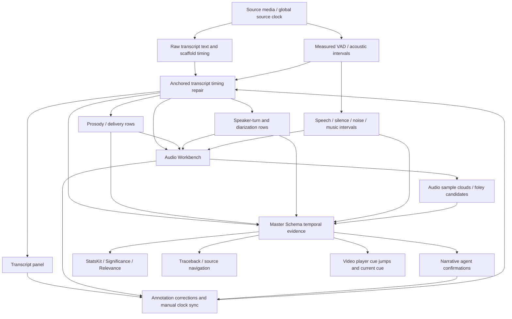

# VAA1 Transcript / Audio / Master Schema Clock RCA - 2026-07-08

## Summary

The transcript, audio, prosody, and Master Schema clock issue was not a single Audio Panel bug. It was a source-authority failure: a transcript with correct text but scaffolded timestamps was allowed to become timing authority for downstream audio and Master Schema surfaces.

The visible symptom was the Bond trailer line:

```text
The world is arming faster than we can respond.
```

appearing too early in the Audio Workbench. The closest measured VAD window places that line at:

```text
20.960-22.215s
```

The first spoken line:

```text
Why would I betray you?
```

starts at about:

```text
6.400s
```

Spoken word does not start at `0.000s`.

## Why It Happened

1. The transcript text was mature enough to use, but its timestamps were scaffold-like (`0-2`, `2-4`, `4-6`, etc.).
2. The initial global offset corrected the opening line but could not correct non-linear drift later in the transcript.
3. `audio_diarization.build_audio_diarization(...)` measured acoustic embeddings inside the transcript intervals it was given. When those intervals were wrong, the artifact could still say `completed_measured` even though the text-to-time alignment was not mature.
4. Audio prosody also sliced waveform windows by transcript segment times, so timing drift affected energy, pitch, pace, pause, and delivery rows.
5. The Master Schema speaker-turn router previously consumed `audio_diarization.speaker_turns` without preserving enough timing authority metadata, so a speaker turn could look like ordinary candidate evidence even when its clock came from a degraded transcript.
6. Frontend panels could apply a global offset and make the opening look correct while hiding later drift.

## When It Happened

The bug class was first documented in:

```text
docs/vaa1_transcript_timing_authority_bug_report_2026-06-05.md
```

The June guard work detected degraded coverage and prevented silent full maturity in some routes. The issue resurfaced during the July 2026 Audio Workbench and StatsKit work because richer audio panels made the incorrect speaker-turn timing visible again.

The key artifact state before repair:

- transcript had correct spoken text but scaffold timing;
- fallback repair had failed with `fallback_did_not_improve_timeline_coverage`;
- `audio_diarization.speaker_turns` inherited the old transcript clock;
- Audio Panel, StatsKit, and Master Schema could see audio rows, but not enough timing authority context.

## What Was Fixed On 2026-07-08

Code-level fixes:

- `src/backend/analysis/transcript_timing_guard.py`
  - detects scaffold transcript clocks;
  - adds anchored VAD timing repair;
  - writes row-level timing status such as `anchor_verified`, `vad_anchor_verified`, `anchored_offset`, and `inherited_after_vad_anchor`.
- `api_server.py`
  - no longer lets the old `fallback_did_not_improve_timeline_coverage` state permanently block anchored repair;
  - regenerates linked transcript, audio prosody, audio event intervals, time-bank audio, POS, Quant, diarization, and audio sample clouds after timing repair;
  - preserves partial repair status instead of presenting degraded coverage as fully repaired;
  - routes speaker turns into Master Schema with timing authority preserved.
- `src/backend/analysis/audio_diarization.py`
  - records the transcript timing authority used to create speaker turns;
  - carries row-level timing status into each turn;
  - marks whether speaker turns can seed mature speaker claims.

Live Bond analysis repair result:

```text
6.400-8.400    Why would I betray you?                         anchor_verified
8.400-10.400   We all have our secrets.                        anchored_offset
10.400-12.400  We just didn't get to yours yet.                 anchored_offset
20.960-22.215  The world is arming faster than we can respond.  vad_anchor_verified
22.960-24.960  Where's 007?                                    inherited_after_vad_anchor
```

Master Schema result:

- speaker-turn temporal segments now carry `timing_status`;
- only `anchor_verified` and `vad_anchor_verified` rows are allowed to seed mature speaker claims;
- inherited/offset rows remain candidate or interpreted evidence until further verified.

## July 9 Regression: Provenance Overwrote Display Clock

The persistent zero-second display bug was traced to a frontend-only regression, not to the repaired transcript artifact.

Evidence:

- local transcript route served `transcription_strategy: anchored_vad_timing_repair`;
- first utterance route payload was `6.400-8.400`;
- fourth utterance route payload was `20.960-22.215`;
- the same repaired rows also preserve provenance fields such as `source_start: 0` and `source_end: 2`.

The failure mechanism:

1. `VideoService.loadTranscriptData(...)` correctly loaded repaired `start/end` values.
2. `applyAnnotationCorrectionsToTranscript(...)` still called `applyTranscriptClockOffset(segment, 0)` when no offset should be applied.
3. `applyTranscriptClockOffset(...)` preferred `sourceStart/sourceEnd` so that repeated offset repair would not compound.
4. With a zero offset, that provenance preference rewrote display time from `start: 6.400` back to `sourceStart: 0`.

The fix is that a zero or invalid offset now returns the segment unchanged. `sourceStart/sourceEnd` remain provenance fields; they are not display clock authority unless a real speech-relative-to-source offset is being applied.

Regression test:

```text
zero clock offset does not let provenance timestamps overwrite repaired global clock
```

Runtime verification after the fix:

```text
0.000-6.400    [Unresolved audio interval]
6.400-8.400    Why would I betray you?
8.400-10.400   We all have our secrets.
10.400-12.400  We just didn't get to yours yet.
12.400-20.960  [Unresolved audio interval]
20.960-22.215  The world is arming faster than we can respond.
```

## Clock Dependency Map



Clock authority rule:

- `start/end` are the current global display and navigation clock.
- `source_start/source_end` are provenance for the old or input timing regime.
- A panel may use `source_start/source_end` only when applying a non-zero, deliberate offset from speech-relative time to source-video time.
- Once a row has `timing_authority: anchored_vad_timing_repair`, zero-offset correction must never rewrite its display clock.

## What Is Still Not Solved

This is a partial repair, not full transcript timing maturity.

Remaining gaps:

- the repaired Bond transcript still has trailing coverage gaps;
- inherited-after-anchor rows are not individually source-verified;
- there is no general analyst-facing row-level timing correction ledger yet;
- Audio Panel confirmation/name/drop/sample actions still need full Master Schema feedback-loop persistence;
- all derived panels must consistently display or carry timing repair state.

## Operating Rule Going Forward

The most mature clock wins:

1. explicit analyst source-time correction;
2. source-verified transcript/audio anchor;
3. measured VAD support;
4. transcript timing only if quality is verified;
5. scaffold timing never silently becomes source truth.

Every derived artifact must preserve timing authority. Datascene should never again allow a neat-looking row to hide a bad clock.
